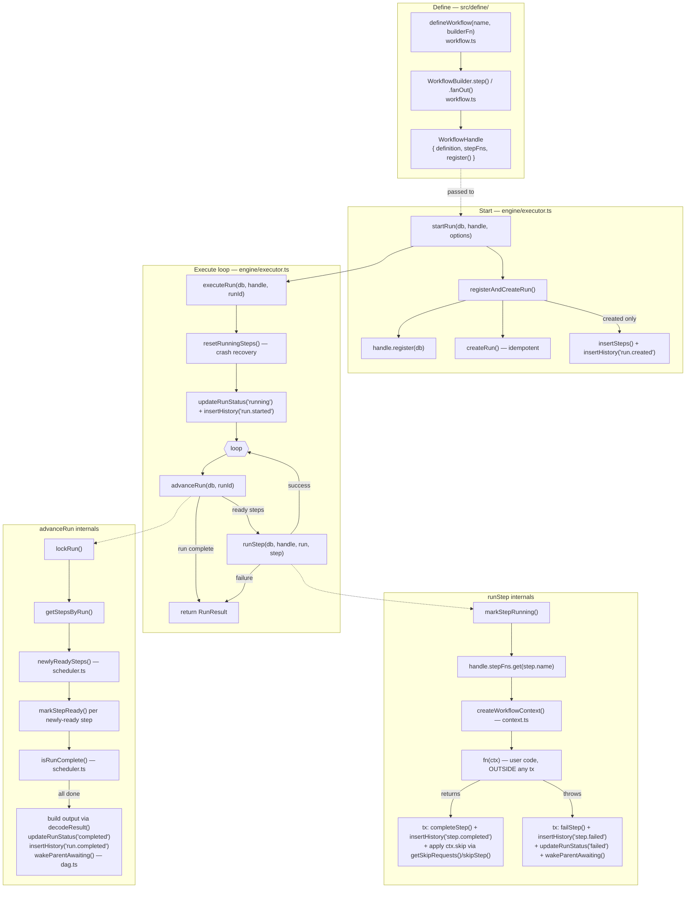

# Flow 01 — Inline run: define a workflow and drive it to completion

**Why this flow first:** it's the spine of the whole engine. Every other flow
(distributed workers, sleep, retry, timeout, cancellation, child workflows,
fan-out/fan-in) is a *variation layered on top* of this one. Learn this and the
rest read as "the same loop, but the outcome can also be suspend / retry /
cancel / block." This is the single-process, in-line path: `startRun` drives the
run to completion (or first failure) on the calling process before returning —
no queue, no leases yet.

The core idea to hold onto: **the `step` table IS the state machine.** The engine
never re-runs your workflow code to "replay" it — it reads step rows, runs
whichever are `ready`, persists the outcome, and repeats. That's why a crash
mid-run is recoverable: on restart the same rows are reloaded and it picks up
where it left off.

---

## Flowchart

All the leaf writes (`createRun`, `insertSteps`, `markStepReady`, `completeStep`,
`failStep`, `updateRunStatus`, `insertHistory`, `lockRun`, `getStepsByRun`, …)
live in [repositories.ts](src/store/repositories.ts) — the **only** place
outside `store/` allowed to touch Postgres. Engine code never inlines SQL; it
calls these typed functions. That's the storage boundary the whole design hangs
on.

---

## Func → func map (everything in the flow)

### Definition side

| Function | File | Calls / hands off to |
|---|---|---|
| `defineWorkflow(name, builderFn)` | [workflow.ts:133](src/define/workflow.ts:133) | builds a `WorkflowBuilder`, runs `builderFn`, returns a `WorkflowHandle` |
| `WorkflowBuilder.step(name, fn, opts)` | [workflow.ts:35](src/define/workflow.ts:35) | records a `StepDefinition` + stashes `fn` in `stepFns` |
| `WorkflowBuilder.fanOut(prefix, n, fn, opts)` | [workflow.ts:73](src/define/workflow.ts:73) | calls `.step()` n times (sugar; no new primitive) |
| `WorkflowHandle.register(db)` | [workflow.ts:149](src/define/workflow.ts:149) | `getWorkflowByName()`; if DAG changed, `insertWorkflow()` |

### Start side — [executor.ts](src/engine/executor.ts)

| Function | File | Calls / hands off to |
|---|---|---|
| `startRun(db, handle, opts)` | [executor.ts:111](src/engine/executor.ts:111) | `registerAndCreateRun()` → `executeRun()` |
| `registerAndCreateRun(db, handle, opts)` | [executor.ts:67](src/engine/executor.ts:67) | `handle.register()`, `createRun()`, and (first creation only) `insertSteps()` + `insertHistory('run.created')` in one tx |
| `enqueueRun(db, handle, opts)` | [executor.ts:127](src/engine/executor.ts:127) | same as start but returns **without** executing (durable/worker path — Flow 02) |

### Execute loop — [executor.ts](src/engine/executor.ts)

| Function | File | Calls / hands off to |
|---|---|---|
| `executeRun(db, handle, runId)` | [executor.ts:143](src/engine/executor.ts:143) | `getRun()`; `resetRunningSteps()`; `updateRunStatus('running')`+`insertHistory('run.started')`; then loops `advanceRun()` → `runStep()` |
| `advanceRun(sql, runId)` | [executor.ts:291](src/engine/executor.ts:291) | `lockRun()`, `getStepsByRun()`, `newlyReadySteps()`, `markStepReady()`; on completion `decodeResult()`, `updateRunStatus('completed')`, `insertHistory('run.completed')`, `wakeParentAwaiting()` |
| `runStep(db, handle, run, step)` | [executor.ts:182](src/engine/executor.ts:182) | `markStepRunning()`, `handle.stepFns.get()`, `createWorkflowContext()`, `fn(ctx)`, then commit success/failure (see rows below) |
| `runStep` success commit | [executor.ts:214](src/engine/executor.ts:214) | `completeStep()`, `insertHistory('step.completed')`, `getSkipRequests()` → `getStepsByRun()` + `skipStep()` |
| `runStep` failure commit | [executor.ts:245](src/engine/executor.ts:245) | `failStep()`, `insertHistory('step.failed')`, `updateRunStatus('failed')`, `wakeParentAwaiting()` |
| `resumeRun` / `resumeAll` | [executor.ts:329](src/engine/executor.ts:329) | resuming a run *is* `executeRun()` from the current step rows (crash recovery across a restart) |

### Pure readiness logic — [scheduler.ts](src/engine/scheduler.ts)

| Function | File | Role |
|---|---|---|
| `dependenciesSatisfied(step, all)` | [scheduler.ts:27](src/engine/scheduler.ts:27) | a dep counts as satisfied when `completed` **or** `skipped` |
| `newlyReadySteps(all)` | [scheduler.ts:35](src/engine/scheduler.ts:35) | every `pending` step whose deps are now all satisfied |
| `isRunComplete(all)` | [scheduler.ts:48](src/engine/scheduler.ts:48) | true when every step is `completed` or `skipped` |
| `isRunBlocked(all)` | [scheduler.ts:59](src/engine/scheduler.ts:59) | true when nothing can ever make progress (dead dep / cycle) |

### The context handed to step code — [context.ts](src/define/context.ts)

| Function | File | Role |
|---|---|---|
| `createWorkflowContext({runId, input, …})` | [context.ts:157](src/define/context.ts:157) | builds the `ctx` a step function receives: `now`, `random`, `sleep`, `skip`, `signal` |
| `ctx.skip(...names)` | [context.ts:191](src/define/context.ts:191) | records "these sibling steps are the untaken branch" (deterministic; writes nothing itself) |
| `getSkipRequests(ctx)` | [context.ts:44](src/define/context.ts:44) | read those names back in `runStep`'s success commit and turn them into `skipStep()` |

---

## The three things worth internalizing

1. **User code runs outside the transaction; only its outcome is atomic.**
   `fn(ctx)` may be slow or call the network, so it runs untransacted — then
   `completeStep`/`failStep` + the history row land together in one tx
   ([executor.ts:214](src/engine/executor.ts:214)). Nothing half-commits.

2. **`advanceRun` is the single "what happens after a step lands" implementation.**
   It's shared with the worker path (Flow 02) so DAG advancement exists once,
   not twice that could drift. It `lockRun()`s first so two sibling fan-in steps
   completing at once can't each miss the other's completion.

3. **`skipped` is treated exactly like `completed` for readiness.** That's what
   lets a conditional branch (`ctx.skip`) not strand a downstream fan-in join —
   see `isResolved` in [scheduler.ts:22](src/engine/scheduler.ts:22).

---

**Next flow to learn → Flow 02: the distributed worker path** — `enqueueRun` +
`createWorker`'s claim/lease/heartbeat loop in
[worker.ts](src/worker/worker.ts). It's this same loop, except a step outcome
can now also be *sleep*, *child-block*, *cancel*, or *timeout*, and every write
is fenced against N other workers.
