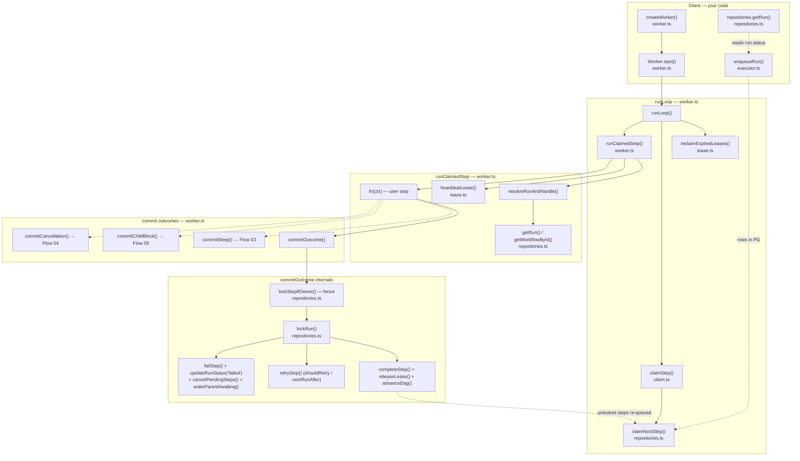

# Flow 02 — Worker path: draining the queue with N processes

**Why this flow second:** it's Flow 01's loop, but the run is driven by a
*separate* worker process (or a whole fleet) instead of the caller. Everything
you learned still holds — the `step` table is the state machine, `advance` then
run the ready ones — except now **N processes race for the same rows with no
shared memory, only Postgres.** That single fact is the whole flow: every read
becomes a *claim* (lease it, don't just read it), every write becomes *fenced*
(prove you still own it), and a crashed worker's step gets *reclaimed* by
someone else.

The client no longer runs anything. `enqueueRun` (Flow 01's durable front door)
drops `ready` rows and returns; the caller polls `getRun` for the result. The
worker and the client never call each other — **Postgres is the only seam.**

> Scope note: `worker.ts` is ~800 lines because it holds *every* outcome a
> claimed step can have, and those span flows 2–5. This doc covers only the
> Flow 02 core — `runLoop` → `runClaimedStep` → `commitOutcome`, plus the
> queue's claim/lease/fence. The `commitSleep` (Flow 03), `commitChildBlock`
> (Flow 05), and `commitCancellation` (Flow 04) siblings are the *same fenced
> pattern* aimed at other outcomes; they get their own flows.

---

## The seam: client and worker share only Postgres

```
CLIENT (your API/script)          POSTGRES                 WORKER FLEET (engine)
────────────────────────          ────────                 ─────────────────────
enqueueRun() ──── writes ──►  run + step rows (ready)
  (returns immediately)              │
                                     │◄──── claimStep() polls ──── runLoop()
                                     │      step → running (leased)      │
                                     │◄──── commitOutcome() ─────────────┤ fn(ctx)
                                     │      step → completed             │
getRun() ◄─── reads ── run.status ───┘      advanceDag: unlock next ─────┘
```

Enqueue and the workers are **decoupled processes**: the client can exit, the
workers can restart, and the run still drains. That decoupling *is* the
durability. See [examples/workers.ts](examples/workers.ts) for all three client
jobs (enqueue, start workers, poll) in one runnable file.

---

## Flowchart



As in Flow 01, every leaf write lives in
[repositories.ts](src/store/repositories.ts) — the only place allowed to touch
Postgres. The queue wrappers ([claim.ts](src/queue/claim.ts),
[lease.ts](src/queue/lease.ts)) exist so `worker.ts` never imports repositories
directly for these.

---

## Func → func map (everything in the flow)

### Client side

| Function | File | Role |
|---|---|---|
| `enqueueRun(db, handle, opts)` | [executor.ts:127](src/engine/executor.ts:127) | `registerAndCreateRun()` then **return** — creates rows, runs nothing |
| `createWorker(opts)` | [worker.ts:150](src/worker/worker.ts:150) | factory: builds private state + inner fns, returns a `Worker` (`start`/`stop`/`inFlight`) |
| `Worker.start()` | [worker.ts:777](src/worker/worker.ts:777) | launches `runLoop()` in the background (does **not** await it) |
| `Worker.stop()` | [worker.ts:785](src/worker/worker.ts:785) | sets `stopping`, awaits the loop + all `inFlight` — graceful drain |
| `repositories.getRun()` | [repositories.ts](src/store/repositories.ts) | client polls run status from outside |

### The loop — [worker.ts](src/worker/worker.ts)

| Function | File | Calls / hands off to |
|---|---|---|
| `runLoop()` | [worker.ts:713](src/worker/worker.ts:713) | periodic `reclaimExpiredLeases()` + `sweepBlockedChildAwaits()`; inner claim loop → `claimStep()` → `runClaimedStep()`; `sleep(pollIntervalMs)` when empty |
| `claimStep(db, opts)` | [claim.ts:25](src/queue/claim.ts:25) | thin wrapper over `claimNextStep()` |
| `claimNextStep(sql, opts)` | [repositories.ts:552](src/store/repositories.ts:552) | `SELECT ... FOR UPDATE OF s SKIP LOCKED LIMIT 1`, then `UPDATE → running` + lease + `attempt+1` |
| `runClaimedStep(step, cache)` | [worker.ts:488](src/worker/worker.ts:488) | `resolveRunAndHandle()`, guards, heartbeat timer, `fn(ctx)`, then dispatch to a `commit*` |
| `resolveRunAndHandle(runId, cache)` | [worker.ts:173](src/worker/worker.ts:173) | `getRun()` + `getWorkflowById()`, memoized in the per-iteration `cache` |

### Commit (the fenced write) — [worker.ts](src/worker/worker.ts)

| Function | File | Calls / hands off to |
|---|---|---|
| `commitOutcome(step, run, outcome)` | [worker.ts:197](src/worker/worker.ts:197) | `lockStepIfOwner()` (fence) → `lockRun()` → success/retry/fail branch |
| success branch | [worker.ts:220](src/worker/worker.ts:220) | `completeStep`, `insertHistory`, `releaseLease`, `advanceDag` (+ skip history) |
| retry branch | [worker.ts:267](src/worker/worker.ts:267) | `shouldRetry()` → `nextRunAfter()` → `retryStep()` + `insertHistory('step.retry_scheduled')` |
| fail branch | [worker.ts:282](src/worker/worker.ts:282) | `failStep`, `updateRunStatus('failed')`, `cancelPendingSteps`, `wakeParentAwaiting` |
| `advanceDag(tx, runId, ...)` | [dag.ts:284](src/engine/dag.ts:284) | worker's equivalent of `advanceRun`: unlock dependents, apply skips, maybe finalize run |

### Lease lifecycle — [lease.ts](src/queue/lease.ts)

| Function | File | Role |
|---|---|---|
| `heartbeatLease(db, stepId, workerId, ttl)` | [lease.ts:37](src/queue/lease.ts:37) | extend the lease; **returns false if it's no longer mine** — the fencing signal |
| `releaseLease(db, stepId)` | [lease.ts:48](src/queue/lease.ts:48) | clear lease ownership without changing status |
| `reclaimExpiredLeases(db)` | [lease.ts:69](src/queue/lease.ts:69) | one sweep tick: expired leases → `ready` (reclaimed), or → `failed` past the poison ceiling (dead-lettered) |
| `heartbeatStep` / `reclaimStep` / `findExpiredLeases` / `lockStepIfOwner` | [repositories.ts:594](src/store/repositories.ts:594)+ | the SQL behind the above, all fenced in their `WHERE` clause |

---

## The three things that make this "Flow 01 + coordination"

1. **Claim, don't read — `SKIP LOCKED`.** `claimNextStep`
   ([repositories.ts:552](src/store/repositories.ts:552)) selects one `ready`,
   due (`run_after <= now()`), unleased row `FOR UPDATE OF s SKIP LOCKED`. The
   `SKIP LOCKED` is the magic word: a row another worker's transaction already
   locked is *skipped*, not waited on — so two workers never receive the same
   step, and the pool scales linearly. It flips the row to `running`, stamps
   `lease_owner` + `lease_expires_at`, and bumps `attempt`.

2. **Fence every write — `lockStepIfOwner`.** User code ran outside any
   transaction and may have taken longer than the lease (GC pause, slow
   network); meanwhile a reclaim sweep may have given the step to someone else.
   So before persisting anything, `commitOutcome`
   ([worker.ts:199](src/worker/worker.ts:199)) re-asserts ownership inside the
   tx. Lost it → **write nothing, discard the outcome.** Committing a stale
   result on top of the new owner's work would corrupt the log. The heartbeat's
   `false` return ([lease.ts:37](src/queue/lease.ts:37)) is the same fence,
   noticed earlier.

3. **Crashes self-heal — lease + reclaim.** A worker that dies stops
   heartbeating; its step's `lease_expires_at` passes; `reclaimExpiredLeases`
   ([lease.ts:69](src/queue/lease.ts:69)) finds it and flips it back to `ready`
   for anyone to re-claim. This is Flow 01's "re-read my own rows on restart,"
   generalized to N processes that can't see each other's memory. A step that
   keeps killing its worker is poisoned after `DEFAULT_MAX_RECLAIMS` (3) instead
   of eating the pool forever.

### Two axes of parallelism (the `#6` vs concurrency distinction)

- **N worker processes**, one queue → `SKIP LOCKED` in `claimNextStep`.
- **N steps per single worker** → the `inFlight.size < concurrency` claim loop
  ([worker.ts:753](src/worker/worker.ts:753)); `runClaimedStep` is started but
  not awaited, and each promise self-removes from `inFlight` via `.finally`.

They compose: 3 workers × concurrency 2 = up to 6 steps in flight across the
fleet (exactly the example's setup).

---

## No per-run driver — the DAG walks itself

Flow 01's `executeRun` owns one run start-to-finish in a `while` loop. **Flow 02
has no such driver.** A worker claims *one step*, runs it, and `commitOutcome`
calls `advanceDag` to flip that step's dependents `pending → ready`. Those newly
-ready steps just sit in the queue for *whatever worker claims them next* —
maybe a different worker on a different machine. The run advances because each
completion unlocks the next, and the pool keeps draining — not because anything
is "running the workflow."

---

**Next flow → Flow 03: sleep, timeout & retry** — the outcomes a claimed step
can have *besides* success/failure. `commitSleep` parks a step as `ready` with a
future `run_after` (a 24h sleep costs a timestamp, no parked worker);
`withTimeout` races the step against `step.timeout_ms`; and the retry branch of
`commitOutcome` you saw here (`shouldRetry` → `nextRunAfter`) is the backoff
engine — already exercised by the example's flaky `transform` step.
