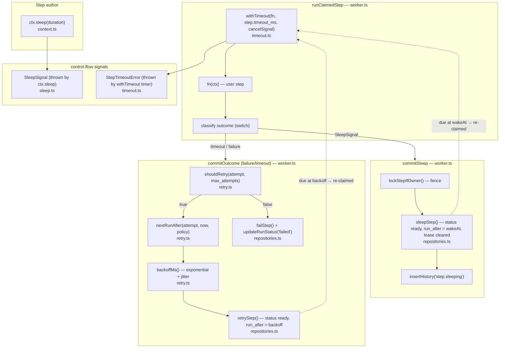

# Flow 03 — Sleep, timeout & retry: the other outcomes of a step

**Why this flow third:** Flow 02 showed a claimed step ending two ways —
success or failure. This flow fills in the three *other* outcomes a running step
can have, all of which land in the worker's `runClaimedStep` because that's the
only place that owns a lease while user code runs:

- **sleep** — the step asks to be suspended for a duration (`ctx.sleep`).
- **timeout** — the step blows its `timeout_ms` budget.
- **retry** — a failed step with attempts left is re-queued with backoff.

None of these is a new loop. They're new *branches* in the classify-outcome
switch you already saw ([worker.ts:687](src/worker/worker.ts:687)), each routing
to a different `commit*`. The unifying idea: **suspension is a row, not a
timer.** A sleeping (or retrying) step is just a `ready` row with a future
`run_after` — no worker parked, no connection held. A 24h sleep costs a
timestamp in a column.

> These three are pure-logic modules ([sleep.ts](src/engine/sleep.ts),
> [timeout.ts](src/engine/timeout.ts), [retry.ts](src/engine/retry.ts)) — no
> Postgres import, unit-testable without a DB. Each *decides*; the worker
> *persists*. Same split as engine/retry vs repositories throughout.

---

## Flowchart

The re-claim edges are the whole trick: `sleepStep` and `retryStep` both leave
the row `ready` with a future `run_after`, and `claimNextStep`'s existing
`run_after <= now()` gate ([repositories.ts:562](src/store/repositories.ts:562))
hides it from the entire fleet until it's due. Then a worker claims it like any
other step and re-runs `fn` from the top.

---

## Func → func map

### Sleep

| Function | File | Role |
|---|---|---|
| `ctx.sleep(duration)` | [context.ts:178](src/define/context.ts:178) | `parseDuration`, bump the per-exec sleep counter; if this sleep is past `sleep_seq`, **throw `SleepSignal`** |
| `parseDuration(input)` | [sleep.ts:68](src/engine/sleep.ts:68) | `"24h"`/`"1h30m"`/`500`→ ms; throws on garbage |
| `SleepSignal` / `isSleepSignal` | [sleep.ts:16](src/engine/sleep.ts:16) | branded control-flow signal (not an error) carrying `wakeAt`, `seq` |
| `commitSleep(step, run, signal)` | [worker.ts:310](src/worker/worker.ts:310) | fence → `sleepStep()` → `insertHistory('step.sleeping')` |
| `sleepStep(tx, {...})` | [repositories.ts](src/store/repositories.ts) | row → `ready`, `run_after = wakeAt`, lease cleared |

### Timeout

| Function | File | Role |
|---|---|---|
| `withTimeout(fn, timeoutMs, parent)` | [timeout.ts:63](src/engine/timeout.ts:63) | `Promise.race(fn(signal), timer)`; timer rejects `StepTimeoutError` then aborts the signal |
| `StepTimeoutError` / `isStepTimeoutError` | [timeout.ts:21](src/engine/timeout.ts:21) | branded; goes through the normal failure/retry path |
| classify branch | [worker.ts:672](src/worker/worker.ts:672) | `isStepTimeoutError(e)` → `{ kind: 'timeout' }` → `commitOutcome({ timedOut: true })` |
| `commitOutcome` timeout label | [worker.ts:258](src/worker/worker.ts:258) | writes `step.timed_out` history, then the *same* retry/fail decision as any failure |

### Retry / backoff

| Function | File | Role |
|---|---|---|
| `shouldRetry(attempt, maxAttempts)` | [retry.ts:45](src/engine/retry.ts:45) | `attempt < maxAttempts`? |
| `nextRunAfter(attempt, now, policy)` | [retry.ts:49](src/engine/retry.ts:49) | `now + backoffMs(...)` |
| `backoffMs(attempt, policy)` | [retry.ts:34](src/engine/retry.ts:34) | `min(maxMs, base·factor^(a-1))`, then full jitter ×[0.5,1] |
| `retryStep(tx, id, error, runAfter)` | [repositories.ts](src/store/repositories.ts) | row → `ready`, `run_after = runAfter`, records the error |
| retry branch | [worker.ts:267](src/worker/worker.ts:267) | `shouldRetry` → `nextRunAfter` → `retryStep` + `insertHistory('step.retry_scheduled')` |

---

## Three things worth internalizing

1. **Sleep replay — the subtle one.** A sleeping step re-runs **from the top**
   when it wakes (a JS stack can't survive a worker restart). To keep it from
   re-suspending on the same `ctx.sleep()` forever, the row counts sleeps
   already served (`step.sleep_seq`) and the context replays against it: sleep
   `#n` where `n <= sleep_seq` resolves *immediately*, only the first sleep
   beyond it actually throws ([context.ts:139](src/define/context.ts:139)). A
   step with two sleeps runs three times total. Corollary: code before a sleep
   runs again, so it observes a fresh `now()`/`random()` — derive durable values
   from `ctx.input`, not the clock.

2. **A timeout can't preempt JS.** `withTimeout` only (a) aborts the signal your
   step may be watching and (b) stops *waiting* for the promise so the worker
   can move on. A step that ignores its signal keeps burning CPU until it
   returns on its own ([timeout.ts:8](src/engine/timeout.ts:8)). The row is
   marked timed-out and the worker freed; the *work* stops only if the step
   cooperates. And a timeout is just a labelled failure — same retry/backoff
   decision as any throw.

3. **Suspension = a re-queued row, never a parked worker.** Sleep and retry are
   the *same mechanism* as the normal queue: `ready` + future `run_after`. That
   is what makes a 24h sleep survive every worker in the pool restarting — the
   wake time was never in anyone's memory, only in a column. `sleep` consumes no
   attempt; `retry` does.

---

**Next flow → Flow 04: cancellation** — a fourth non-failure outcome, but this
one is requested from *outside* the worker. `cancelRun` only writes a flag; the
worker that owns the running step observes it on its heartbeat tick and
finalizes cooperatively (you can't kill a function in another process).
