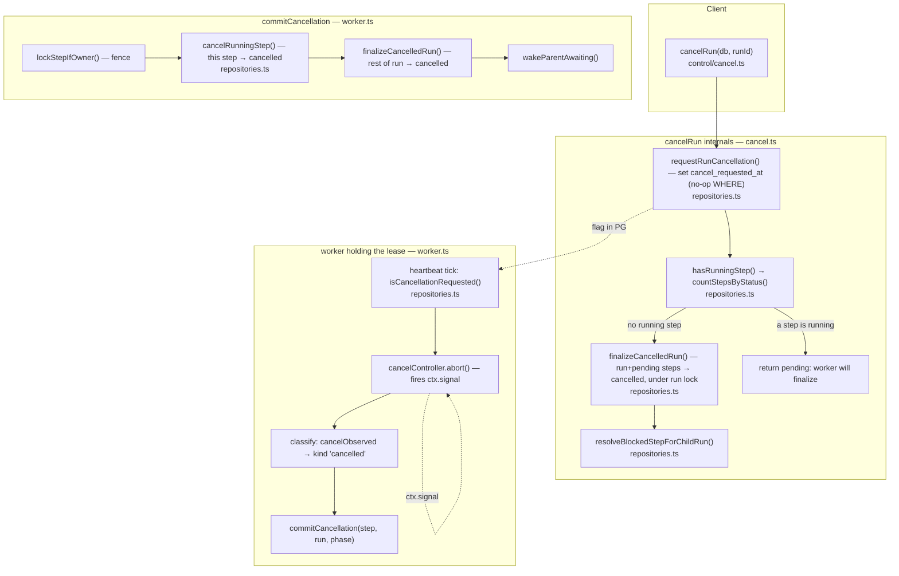

# Flow 04 — Cancellation: stopping a run from outside

**Why this flow fourth:** every outcome so far was decided *by the worker
running the step*. Cancellation is the first one requested from **outside** —
a client calls `cancelRun(db, runId)` while the run may be executing in some
other process. You cannot kill a function running in another process, so
cancellation is **cooperative**: the caller writes a durable *request*, and the
worker that owns the running step observes it and closes out its own step at a
safe point. The honest contract, exposed in `CancelResult`, is "the request is
durable; finalization happens at the next safe point" — not "every cancel is
synchronous."

The rule this whole flow protects: **the canceller never touches a `running`
step.** Doing so would be the exact unfenced double-write that Flow 02's commit
fencing exists to prevent. Only the lease owner closes out its own step.

---

## Two paths, decided by one question: is a step `running`?

Two entry points end a cancelled run, and which one fires depends purely on
whether a worker is mid-call:

- **No `running` step** → `cancelRun` finalizes it **synchronously** right there
  (`finalized: true`).
- **A step is `running`** → `cancelRun` only records the flag (`pending: true`);
  the owning worker finalizes on its next heartbeat tick.

---

## Func → func map

### Client side — [cancel.ts](src/control/cancel.ts)

| Function | File | Calls / role |
|---|---|---|
| `cancelRun(db, runId)` | [cancel.ts:53](src/control/cancel.ts:53) | `requestRunCancellation` → decide via `hasRunningStep` → sync-finalize or return `pending` |
| `requestRunCancellation(db, runId)` | [repositories.ts](src/store/repositories.ts) | set `cancel_requested_at`; no-op `WHERE` if terminal/already-set |
| `hasRunningStep(db, runId)` | [cancel.ts:40](src/control/cancel.ts:40) | `countStepsByStatus`; `running > 0`? |
| `finalizeCancelledRun(db, runId)` | [repositories.ts](src/store/repositories.ts) | under run lock: run → `cancelled`, `pending`/`ready` steps → `cancelled`; leaves `running` alone |
| `resolveBlockedStepForChildRun(db, runId)` | [repositories.ts](src/store/repositories.ts) | wake a parent blocked on this (now-terminal) run |
| `isRunCancelled(db, runId)` | [cancel.ts:92](src/control/cancel.ts:92) | read the flag |
| `sweepCancelledRuns(db)` | [cancel.ts:101](src/control/cancel.ts:101) | timer janitor: finalize requested-but-not-running runs (owner crashed after the request) |

### Worker side — [worker.ts](src/worker/worker.ts)

| Function | File | Calls / role |
|---|---|---|
| checkpoint #1 (pre-run) | [worker.ts:537](src/worker/worker.ts:537) | `isCancellationRequested` right after claim → `commitCancellation('pre-run')` before running |
| checkpoint #2 (in-flight) | [worker.ts:596](src/worker/worker.ts:596) | on the heartbeat tick: `isCancellationRequested` → `cancelController.abort()` → `ctx.signal` fires |
| classify branch | [worker.ts:665](src/worker/worker.ts:665) | `cancelObserved` outranks timeout/failure → `{ kind: 'cancelled' }` |
| `commitCancellation(step, run, phase)` | [worker.ts:435](src/worker/worker.ts:435) | fence → `cancelRunningStep` → (sep. tx) `finalizeCancelledRun` → `wakeParentAwaiting` |
| `cancelRunningStep(tx, {...})` | [repositories.ts](src/store/repositories.ts) | this worker's `running` step → `cancelled` (fenced on `lease_owner`) |

---

## Three things worth internalizing

1. **The canceller writes a flag, never a step.** `cancel_requested_at` is not
   visible in `run.status` (the run stays `running` until finalized), so both
   worker checkpoints take a *fresh* read of the flag, not the cached run row.
   Checkpoint #1 stops a doomed step before it starts; checkpoint #2 rides the
   heartbeat timer that already round-trips to Postgres, so noticing a cancel
   costs one extra cheap `exists(...)` on a connection already in use — no new
   timer, no new poll.

2. **`abort()` is all a worker can do to a running step.** Same JS-has-no-
   preemption truth as timeout: aborting `ctx.signal` lets a *cooperative* step
   bail; an uncooperative one keeps running. Cancellation also outranks the
   timeout label — once we abort, whatever the step throws (an AbortError, or a
   later budget-blowout) is a *consequence* of the cancel, so it's recorded as
   `cancelled`, not `timed_out` ([worker.ts:665](src/worker/worker.ts:665)).

3. **Benign races, closed by the run lock.** A worker can claim a `ready` step
   between `cancelRun`'s count and its finalize — fine: `finalizeCancelledRun`
   takes the run lock and leaves `running` steps alone, so that worker still
   owns its step's fenced commit and still wins; the run just reaches
   `cancelled` a beat before that one step does. And a cancelled run is
   terminal, so — like every terminal transition — it wakes any parent blocked
   on it as a child.

---

**Next flow → Flow 05: child workflows & DAG orchestration** — the last flow
ties the loose ends you've seen (`wakeParentAwaiting`, `advanceDag`,
`ctx.skip`): a step spawns a child run and suspends into `blocked` (a fifth
outcome, sibling of sleep), woken by the child's terminal transition; plus
fan-out/fan-in and conditional-skip cascades, all expressed with plain
`dependsOn` and no new schema.
