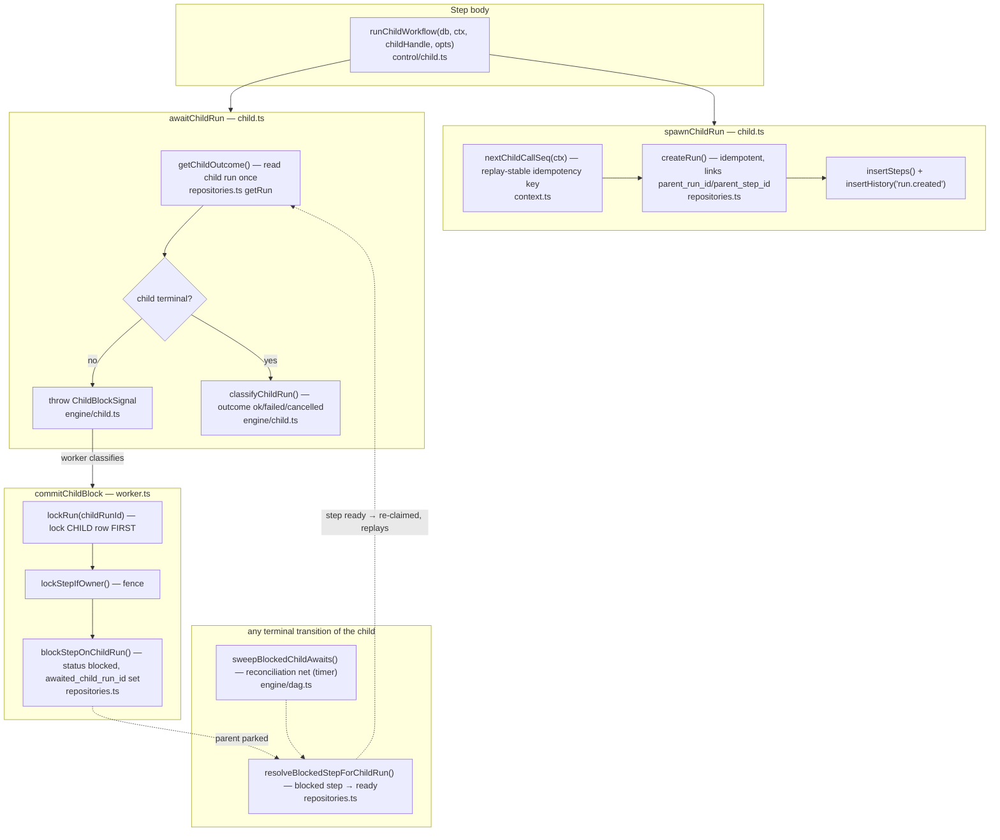
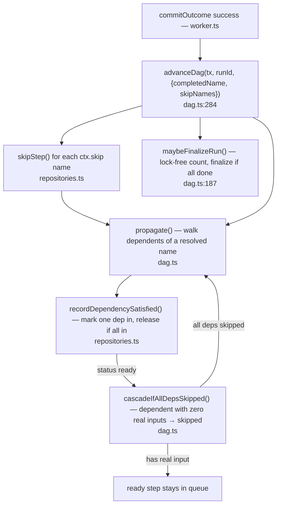

# Flow 05 — Child workflows & DAG orchestration

**Why this flow last:** it ties together every loose end the earlier flows kept
deferring — `wakeParentAwaiting`, `advanceDag`, `ctx.skip`, the `blocked`
status. Two related capabilities:

- **Child workflows (#20)** — a step spawns another run and waits for it,
  suspending into `blocked` (a fifth step outcome, the sibling of sleep). The
  wait is **event-driven, not polled**: the parent suspends exactly once and is
  woken by the child's terminal transition.
- **DAG orchestration (#15/#16/#17)** — fan-out, fan-in, and conditional
  branching, all expressed with plain `dependsOn` and `ctx.skip` — **no new
  schema, no new scheduling primitive.** This is what the worker's `advanceDag`
  does on every successful commit.

The theme: **resolution is a property of a row, not of a process.** Whichever
worker finishes the child wakes the parent, even if the process that spawned it
is long dead — same durability posture as sleep.

> The inline driver (`startRun`/`executeRun`) does **not** support child
> workflows, same as it doesn't support `ctx.sleep`: it's single-process and
> sequential, so nothing would run the child. A `ChildBlockSignal` there is
> treated as an ordinary failure. Child workflows are a worker-path feature.

---

## Part A — Child workflows

The loop of it: `runChildWorkflow` spawns the child (once, idempotently), then
`awaitChildRun` reads the child's status. Not terminal → throw
`ChildBlockSignal` → worker parks the step `blocked` and frees the slot. When the
child finishes (any terminal path), `resolveBlockedStepForChildRun` flips the
parent step back to `ready`; a worker re-claims it, the step **replays from the
top**, and this time `getChildOutcome` returns instead of throwing — so the step
runs straight through.

### Func → func map (children)

| Function | File | Role |
|---|---|---|
| `runChildWorkflow(db, ctx, handle, opts)` | [child.ts:283](src/control/child.ts:283) | spawn+await; **throws `ChildWorkflowError`** if child failed/cancelled (default policy) |
| `runChildWorkflowResult(...)` | [child.ts:254](src/control/child.ts:254) | same, but returns the outcome instead of throwing (compensation) |
| `spawnChildRun(db, ctx, handle, opts)` | [child.ts:117](src/control/child.ts:117) | idempotent `createRun` linking parent; defaults child namespace to parent's |
| `nextChildCallSeq(ctx)` | [context.ts:60](src/define/context.ts:60) | replay-stable key so a replayed parent step doesn't spawn a 2nd child |
| `awaitChildRun(db, ctx, childRunId)` | [child.ts:231](src/control/child.ts:231) | `getChildOutcome` once; still in flight → **throw `ChildBlockSignal`** |
| `getChildOutcome(db, childRunId)` | [child.ts:184](src/control/child.ts:184) | terminal? classify: output on success, step error on fail/cancel |
| `classifyChildRun(status, output, error)` | [child.ts:127](src/engine/child.ts:127) | policy: which terminal status → `ok`/`failed`/`cancelled` |
| `ChildBlockSignal` / `isChildBlockSignal` | [child.ts:69](src/engine/child.ts:69) | branded control-flow signal (sibling of `SleepSignal`) |
| `commitChildBlock(step, run, signal)` | [worker.ts:367](src/worker/worker.ts:367) | lock child row → fence → `blockStepOnChildRun`; wake immediately if child already terminal |
| `wakeParentAwaiting` / `resolveBlockedStepForChildRun` | [dag.ts:235](src/engine/dag.ts:235) | the wake: `blocked` step → `ready` (one indexed UPDATE; no-op for non-children) |
| `sweepBlockedChildAwaits(db)` | [dag.ts:261](src/engine/dag.ts:261) | timer net: re-offer any `blocked` step whose child is terminal (should be zero) |

### Why the lock order in `commitChildBlock` is load-bearing

The **child** run row is locked *first* — before the step's own fence, before
the parent run ([worker.ts:369](src/worker/worker.ts:369)). Every finalizer
calls `resolveBlockedStepForChildRun` while holding (or just after releasing)
that same child-row lock, so block and wake are serialized on it — the two
orderings are the only outcomes and both are correct:

- **block first** → the finalizer waits, then sees `blocked` and flips it `ready`.
- **finalize first** → `commitChildBlock`'s `lockRun` waits, reads the now-
  terminal status, and un-blocks the step in place — leaving it `ready`.

That's how "the child finishes between the outcome read and the block write" can
never strand a parent.

---

## Part B — DAG orchestration (`advanceDag`)

This is what the worker's success commit calls instead of the inline path's
whole-run `advanceRun` rescan. It turns *one* step's resolution into whatever
else becomes runnable, touching only that step's direct dependents (a point
lookup, not an O(run) rescan under the commit lock).

### Func → func map (orchestration)

| Function | File | Role |
|---|---|---|
| `advanceDag(sql, runId, resolution)` | [dag.ts:284](src/engine/dag.ts:284) | apply `skipNames`, `propagate` the completed name, `maybeFinalizeRun` |
| `propagate(sql, runId, startName)` | [dag.ts:136](src/engine/dag.ts:136) | BFS over dependents; releases each fully-satisfied one, recursing through cascade-skips |
| `recordDependencySatisfied(sql, id, depName)` | [repositories.ts](src/store/repositories.ts) | single UPDATE + containment check on `satisfied_deps`; releases a fan-in join **exactly once** under N concurrent callers |
| `cascadeIfAllDepsSkipped(sql, dependent)` | [dag.ts:115](src/engine/dag.ts:115) | if *every* dep resolved by skip (none completed) → skip this step too |
| `maybeFinalizeRun(sql, runId)` | [dag.ts:187](src/engine/dag.ts:187) | `countStepsByStatus` (lock-free); escalate to `lockRun` + finalize only when it looks done |

### The three orchestration features, all from `dependsOn`

- **Fan-out (#15)** — N steps naming the same `dependsOn` all go `ready`
  together when it resolves; N workers claim them in parallel (`SKIP LOCKED` is
  already safe). `fanOut()` ([workflow.ts:73](src/define/workflow.ts:73)) is just
  sugar for N `.step()` calls.
- **Fan-in (#16)** — one step depending on all N names. `recordDependencySatisfied`'s
  once-only release is what makes ten siblings completing concurrently fire the
  join exactly once, no deadlock (proven in repositories-dag.test.ts).
- **Conditional branching (#17)** — `ctx.skip(...)` names untaken siblings; a
  `skipped` dep satisfies readiness exactly like `completed`
  ([scheduler.ts:22](src/engine/scheduler.ts:22)), so a join past an untaken
  branch never strands. `cascadeIfAllDepsSkipped` stops an untaken branch's
  *whole downstream chain* from running dead code.

---

## The one idea across both parts

Everything here is **state in a row, resolved by whichever worker gets there** —
never a held connection, a timer, or the spawning process. A blocked parent is a
row (`status='blocked'`, `awaited_child_run_id`); a fan-in join is a row
(`satisfied_deps`); completion is a count. That's the same durability property
Flow 01 got from "re-read my own step rows on restart," now spanning nested runs
and concurrent fan-out across a whole fleet.

---

**Beyond these five flows:** the codebase has since grown further phases —
events (`ctx.waitForEvent` / `publishEvent`, the `step.waiting_for_event`
branch you spotted in `runStep`), plus per-step concurrency keys and rate limits
(the `concurrencyKey`/`rateKey` fields on `NewStep`), and richer terminal
statuses (`dead_letter`, `completed_with_errors`). Each is a candidate for its
own flow doc when you get there.
